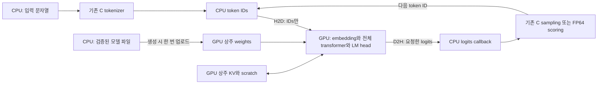

# CUDA forward-only 전환 상세 계획

작성일: 2026-09-23. 현재 **FP32 CUDA forward·CLI 구현 및 정확성 gate 통과**.
사용자가 전체 forward 검증 후 제한된 CPU/GPU 속도 비교를 추가 승인했다.
[Task 12](../tasks/12-cuda-forward-comparison.md)와 [결과](../cuda-results.md)가 현재 구현·검증 기준이다.
아래 내용은 원래 단계별 설계이며, 계획 시점의 “벤치마크 중단” 지시는 이번 제한 비교에 한해 갱신됐다.
전체 평가·이전 양자화 성능 matrix는 여전히 자동 실행하지 않는다.

현재 차이: Q/K projection은 정확성 gate를 위해 FP32 보상 누적을 사용하고,
다른 linear와 attention QK/PV는 cuBLAS를 사용한다. trace는 tensor site를 지원하며
CPU MathOps scalar replay site는 내보내지 않는다. 설치된 sanitizer의 실행 불가로
C6 메모리 계측 검증은 미확인이다. 공개 API는 `include/sm_cuda.h`를 따른다.

## 1. 최신 요청과 작업 범위

사용자는 남은 성능 측정과 full 평가를 더 진행할 필요가 없다고 했으며,
CUDA 작업으로 방향을 바꿨다. 이어서 이번 세션에는 상세 계획을 작성하고
새 세션으로 넘어가라고 요청했다. 따라서 다음 사항이 우선한다.

- 기존 CPU benchmark/full evaluation을 재개하지 않는다. 이전 결과는 보존한다.
- 다음 구현 목표는 **SmolLM2-135M Base의 FP32 forward 전체를 단일 GPU에서 실행**하는 것이다.
- CPU는 파일 검증/토크나이저/호출 제어/샘플링/FP64 점수 계산/결과 출력을 유지한다.
- 학습, backward, autograd, optimizer, PyTorch 추론 의존성은 추가하지 않는다.
- 첫 완료 범위는 FP32 weights + FP32 KV cache다. W8A8/KV8 CUDA는 후속 단계로 분리한다.
- 성능 측정, 긴 평가, Tensor Core 튜닝, FlashAttention 도입은 첫 구현의 완료 조건이 아니다.
- CUDA의 작은 correctness test와 고정 probe 비교는 구현 검증에 필요하다.
  이를 이유로 이전 24조건 성능 matrix나 full 데이터 평가를 재시작하지 않는다.
- 과거의 “CUDA는 이번 범위 밖”은 CPU 단계의 제약이었다. 이번 사용자 지시로 CUDA만
  새 범위에 포함된다. model revision, tokenizer, scoring, 수치 계약은 계속 유지한다.
- Skill/agent 설정은 프로젝트 로컬만 사용한다. 전역 설정, 프로젝트 `.codex`를 변경하지 않는다.
- 이 계획 작성 세션은 문서와 환경 정보만 기록한다. 패키지 설치, 빌드, 테스트,
  CUDA kernel 실행 및 추가 모델 측정은 하지 않는다.

첫 단계는 “GPU에서 전체 forward가 정확하게 동작하고 기존 C에서 호출 가능”해야 완료다.
단순 GEMM 몇 개를 CUDA로 치환한 상태나 GPU에서 생성 문자열만 나오는 상태는 완료가 아니다.

## 2. 통상적인 연동 방식과 이 프로젝트의 선택

일반적으로 C 프로그램이 CUDA C++로 작성한 라이브러리를 **C ABI**로 호출한다.
CUDA Runtime이 GPU 메모리와 stream을 관리하고, cuBLAS와 직접 작성한 CUDA kernel이
forward를 수행한다. shared library와 별도 프로세스는 필수가 아니다.
첫 구현은 기존 executable에 CUDA object를 링크한다.



핵심은 **weights, KV cache, intermediate activations를 GPU에 계속 두는 것**이다.
매 layer마다 CPU로 activations를 가져와 norm/softmax를 처리하는 구조는 채택하지 않는다.
GPU 계산 명령은 비동기로 enqueue할 수 있지만, 첫 공개 API는 기존 C와 맞게
호출이 반환될 때 결과와 오류가 확정되는 동기식 계약으로 시작한다.
stream 순서와 host 동기화의 기본 동작은 [NVIDIA asynchronous execution 문서](https://docs.nvidia.com/cuda/cuda-programming-guide/02-basics/asynchronous-execution.html)를 따른다.

| 위치 | 책임 | 첫 단계 데이터 타입 |
|---|---|---|
| CPU | 모델 파일 파싱·검증, 설정, tokenizer | 기존 형식 |
| CPU | token validation, session position과 호출 수명 관리 | uint32 / size_t |
| GPU | embedding lookup, norms, QKV/O/MLP/LM head | FP32 |
| GPU | split-half RoPE, GQA attention, mask, softmax, SiLU, residual | FP32 |
| GPU | 모든 layer의 K/V와 재사용 scratch | FP32 |
| CPU | greedy/stochastic sampling, NLL/KL/MC 비교 | 기존 FP64 scoring |
| CPU | JSONL/CSV, trace serialization, 오류 문자열 | 기존 C 경로 |

## 3. 확인된 환경과 아직 확인하지 않은 것

2026-09-23에 실행한 것은 아래의 읽기 전용 조회뿐이다.

| 항목 | 관측값 |
|---|---|
| GPU | NVIDIA GeForce RTX 4070 Ti |
| driver | 591.86 |
| 보고된 총 VRAM | 12,282 MiB; 가용량은 별도 확인 필요 |
| compute capability | 8.9 |
| nvcc 경로/버전 | `/usr/bin/nvcc`, CUDA 11.5, V11.5.119 |
| nvidia-smi 경로 | `/usr/lib/wsl/lib/nvidia-smi` |
| 실행 환경 | 기존 WSL2 Linux workspace |
| nvcc 지원 cubin target | `sm_35`부터 목록상 `sm_87`까지; `sm_89` 없음 |
| loader에 보이는 libraries | `libcudart.so.11.0`, `libcublas.so.11`, `libcublasLt.so.11` |
| driver library | WSL 경로와 `/usr/lib/x86_64-linux-gnu/` 경로 모두 목록에 보임 |

실행 명령은 `nvidia-smi --query-gpu=name,driver_version,memory.total,compute_cap --format=csv,noheader`,
`nvcc --version`, `nvcc --list-gpu-code`, `ldconfig -p`였다.
GPU allocation, kernel launch, cuBLAS 호출, sanitizer는 **아직 검증하지 않았다**.
설치된 cuBLAS의 정확한 runtime version과 실제 로드되는 library 경로도 다음 단계에서 기록한다.

### 3.1 Toolkit 문제를 처리하는 기본 방침

현재 nvcc로 `-arch=sm_89`를 지정하지 않는다. 초기 호환성 경로는 다음과 같다.

```text
-gencode=arch=compute_86,code=sm_86
-gencode=arch=compute_86,code=compute_86
```

CUDA 11.0–11.7의 Ampere cubin/PTX를 Ada에서 사용하는 경로와 CUDA 11.8의 native
Ada 지원은 [NVIDIA Ada compatibility guide](https://docs.nvidia.com/cuda/ada-compatibility-guide/index.html)에 설명돼 있다.
이는 현재 설치가 실제로 동작한다는 검증 결과가 아니다. 작은 C→CUDA→cuBLAS 실행으로 확인한다.

- 우선 기존 설치로 컴파일·링크·실행 가능성을 확인한다.
- 현대 문서에 있는 enum/API가 모두 11.5 header에 있다고 가정하지 않는다.
- `libcuda` stub을 runtime에서 사용하지 않도록 실제 링크와 로드 경로를 확인한다.
- 실패가 toolkit/library 호환성 때문인지 WSL driver 접근 때문인지 구분한다.
- 필요할 때에만 추가 toolkit 경로를 선택한다. 전역 CUDA 교체나 driver 설치를 임의로 하지 않는다.
- 새 다운로드/설치가 필요하면 workspace-local 위치와 정확한 버전을 계획에 추가하고,
  실제 도구의 네트워크/쓰기 권한 절차를 따른다. 새 toolkit이 이미 필요한 것으로 단정하지 않는다.
- JIT cache를 사용하면 `CUDA_CACHE_PATH`를 프로젝트의 무시된 `.cache/cuda/`로 둘 수 있다.
  성능용 JIT/그래프 최적화는 이 단계에서 진행하지 않는다.

## 4. 기존 코드에서 먼저 알아야 할 경계

| 기존 파일 | 현재 역할 | CUDA 작업에서의 처리 |
|---|---|---|
| `include/smollm.h` | CPU Model/Session와 callback API | 기존 함수/구조의 의미 유지, C++ linkage guard 검토 |
| `src/model.c` | mmap loader, shape/name/dtype/content validation | 재사용; CUDA가 별도 파일 parser를 만들지 않음 |
| `src/session.c` | CPU forward 및 CPU `SmSession` 정의 | CPU reference로 유지 |
| `src/kernels.c` | CPU OpenBLAS와 GS64 연산 | CPU reference로 유지 |
| `src/cache.c` | CPU cache storage | CUDA cache는 별도 device 구현 |
| `src/math_ops.c` | CPU scalar math callbacks | CUDA device 함수 포인터로 재해석하지 않음 |
| `include/sm_cli.h`, `src/cli_common.c` | `SmRun`이 CPU session을 직접 소유 | 여기서 상위 backend dispatch 추가 |
| `src/main.c` | logits/chunks 등 CPU session 직접 호출 | 공통 실행 wrapper로 교체할 호출부 목록 작성 |
| `src/generate.c`, `src/evaluate.c` | sampling/scoring + forward 호출 | forward 호출만 dispatch로 연결 |
| `src/benchmark.c` | CPU wall-clock 측정 | 지금 GPU 성능 지원을 주장하지 않음 |
| `src/replay.c` | C에서 trace/replay 및 수치 비교 | CUDA trace host 결과를 소비; CPU replay와 GPU math를 구분 |

`SmKernelOps`에는 “CPU host pointers, not a device/backend ABI”가 명시돼 있다.
추가로 attention은 `KernelOps`를 통하지 않고 `cblas_sgemm`을 직접 호출하며,
norm/RoPE/softmax/SiLU/residual도 CPU loop다. 따라서 GEMM callback만 바꿔서는
전체 forward가 GPU로 옮겨지지 않는다.

## 5. API와 소유권 설계

### 5.1 별도 opaque CUDA 객체

첫 단계는 CPU `SmSession`을 GPU 포인터가 섞인 객체로 재작성하지 않는다.
아래 이름으로 별도 객체를 추가하는 것을 기본안으로 한다.

```c
/* 계획 예시: 아직 존재하지 않는 API */
typedef struct SmCudaModel SmCudaModel;
typedef struct SmCudaSession SmCudaSession;

int sm_cuda_model_create(const SmModel *validated_host_model, int device,
                         SmCudaModel **out, SmError *error);
void sm_cuda_model_free(SmCudaModel *model);
int sm_cuda_session_create(const SmCudaModel *model, SmKVType kv,
                           size_t context, size_t chunk,
                           SmCudaSession **out, SmError *error);
void sm_cuda_session_free(SmCudaSession *session);
int sm_cuda_session_reset(SmCudaSession *session, SmError *error);
int sm_cuda_prefill(SmCudaSession *session, const uint32_t *host_tokens,
                    size_t count, SmLogits mode, SmLogitCallback callback,
                    void *ctx, SmError *error);
int sm_cuda_decode(SmCudaSession *session, uint32_t token, SmLogits mode,
                   SmLogitCallback callback, void *ctx, SmError *error);
```

구현 시 position/trace/memory getter도 추가한다. 명칭은 C1에서 확정하고 동일 기능의 API를 중복 생성하지 않는다.

- `include/sm_cuda.h`에는 C++용 `extern "C"` guard를 두고 순수 C에서도 사용할 수 있게 한다.
- 기존 `smollm.h`에도 필요한 linkage guard를 추가해 C로 컴파일한 함수를 CUDA C++에서 호출한다.
- 공개 header에 CUDA Runtime/cuBLAS 타입을 노출하지 않는다. device pointer는 opaque 객체 안에 둔다.
- 검증된 tensor는 `sm_model_config` / `sm_model_tensor` 공개 accessor로 가져온다.
  이름은 기존 export 계약을 따른다. CPU private `SmSession` layout에 의존하지 않는다.
- CUDA model은 필요한 config/이름 정보를 복사하고, weights upload 완료 후 create에서 반환한다.
  생성 이후 host tensor data를 계속 참조하지 않는 구조로 한다.
- CLI는 기존 metadata 때문에 host model도 보관할 수 있다. 각각의 소유자를 명시한다.
- CUDA session은 CUDA model을 빌려 쓴다. session → CUDA model → host model 순으로 해제한다.
- immutable GPU weights는 여러 session이 공유할 수 있다. KV/scratch/stream/cuBLAS handle은 session별이다.
- 같은 session의 동시 호출이나 callback에서의 재진입은 지원하지 않는다고 명시한다.
- 객체의 device ID를 보관하고 호출/해제 시 올바른 device context를 사용한다.

### 5.2 C CLI와 연결

`SmRun`에 backend 구분과 CPU/CUDA 객체를 보관하고 아래의 공통 C wrapper를 제안한다.
기존 공개 `sm_prefill`의 의미는 바꾸지 않는다.

```text
sm_run_prefill / sm_run_decode
sm_run_reset / sm_run_position
sm_run_set_trace
sm_run_memory_info
```

각 command의 `run.session` 직접 참조를 검색해 wrapper로 옮긴다.
CPU wrapper는 기존 함수를 그대로 호출하고, CUDA 없는 build에서 기존 tests를 유지한다.
GPU session을 만들 때 CPU session도 함께 중복 생성하지 않는다.
CPU reset은 void지만 CUDA reset은 동기화 오류가 가능하므로 wrapper는 status를 반환한다.

CLI 기본안은 `--backend cpu|cuda`(기본 CPU), `--device N`이다.
`--threads`는 CPU 측 설정이며 GPU block/thread 수로 해석하지 않는다.
CUDA 없는 build의 `--backend cuda`는 명시적으로 실패해야 한다.
GPU 사용 실패 시 CPU로 조용히 fallback하지 않는다.
FP32-only 단계에서는 Q8 model/KV8 요청을 allocation 전에 거부한다.

## 6. GPU 메모리와 전송 계약

### 6.1 CUDA model

- FP32 matrix/norm weights를 생성 시 한 번만 upload한다.
- tied embedding과 LM head는 동일 device allocation을 공유한다.
- 파일 descriptor/padding은 GPU에서 필요 없다. tensor payload와 allocation 소유권 표를 관리한다.
- 모든 size 계산에 overflow 검사를 적용하고 부분 생성 실패 시 할당한 자원을 정리한다.
- 모델 파일 538,095,104 bytes와 실제 device weight payload bytes를 구분한다.

### 6.2 CUDA session

| Buffer | 형태와 수명 |
|---|---|
| K/V | 각각 `[layers, kv_heads, context, head_dim]`, session 수명 |
| token IDs | 최대 chunk 분량, staging 재사용 |
| hidden/norm/Q/attention/projection | chunk에 비례, layer 사이 재사용 |
| 생성 직후 K/V | `[chunk, kv_heads * head_dim]`, cache로 scatter |
| gate/up | `[chunk, hidden]`, layer 사이 재사용 |
| packed Q/head output | `[chunk, head_dim]`, head 사이 재사용 |
| scores | `[chunk, context]`, head 사이 재사용 |
| logits | LAST 1행, ALL 최대 chunk행, 필요 시 할당 |
| frequency | head_dim/2, 생성 시 한 번 upload |
| status flag | 비유한수와 실행 중 수치 오류 기록 |
| host logits staging | callback 동안 유효, 필요하면 pinned buffer |

CUDA KV는 head-major를 기본안으로 한다. CPU cache와 같은 layout이라고 가정하지 않는다.
layout 변환은 trace와 독립 입력으로 확인한다. K/V를 매 head마다 host에서 pack하지 않는다.
score는 모든 layer/head 분량을 상주시킬 필요 없이 head 하나의 영역을 재사용할 수 있다.
GQA는 query head 3개를 각 KV head에 대응시키고 KV를 9head 분량으로 복제하지 않는다.

FP32 KV 용량은 `2 * layers * context * kv_heads * head_dim * sizeof(float)`이다.
이 모델에서 context2048은94,371,840 bytes(90 MiB), context8192는377,487,360 bytes(360 MiB)다.
logits 1행은196,608 bytes, 128행은25,165,824 bytes(24 MiB)다.
이는 설계상 용량 계산이며 새로 측정한 메모리 결과가 아니다.

### 6.3 호출별 전송

1. 전체 token IDs와 context 상한을 CPU에서 먼저 검사한다.
2. chunk의 token IDs만 GPU로 전송한다.
3. embedding부터 마지막 필요한 projection까지 GPU에서 실행한다.
4. 요청된 logits와 status만 CPU로 복사한다.
5. stream 동기화 후 기존 C callback/scoring/sampling을 호출한다.

`NONE`은 LM head를 생략하되 cache 갱신과 오류 확인은 완료한다.
`LAST`는 여러 chunk 중 마지막 chunk의 마지막 token만 project한다.
`ALL`은 최대 chunk행만 유지하며 절대 position 순서대로 callback한다.
callback의 logits pointer는 호출 중에만 유효하며 device pointer를 넘기지 않는다.
callback==NULL이어도 LAST/ALL의 projection 자체를 생략하지 않는다.
trace/callback이 없으면 logits의 D2H 복사는 생략할 수 있으나 device finite 검사와 API 동기화는 유지한다.

초기 버전은 single stream / single in-flight call이다. CPU가 읽기 전에 staging을 덮어쓰지 않는다.
`cudaMemcpyAsync`라는 이름만으로 pageable memory의 비동기 overlap을 보장한다고 가정하지 않는다.
pinned buffer는 크기/개수를 제한하고 session에서 재사용한다.

## 7. Forward 계산의 구현 순서

### 7.1 Embedding과 RoPE 주파수

- token ID의 FP32 embedding 행을 GPU에서 gather한다.
- 주파수는 CPU와 동일한 `1.0f / powf(theta, (float)(2*j)/(float)head_dim)`으로
  host에서 한 번 생성해 upload한다. 매 token의 angle/sin/cos/rotation은 GPU에서 실행한다.
- 한 번 생성하는 상수와 매 forward를 CPU에서 계산하는 방식을 구분한다.

### 7.2 FP32 선형층

처음에는 prefill/decode 모두 cuBLAS FP32 GEMM으로 정확한 공통 경로를 만든다.
rows==1의 GEMV/custom decode 최적화는 나중에 분리할 수 있다.
layout과 compute mode는 [NVIDIA cuBLAS 문서](https://docs.nvidia.com/cuda/cublas/index.html)를 참고하고
실제 설치한 toolkit의 header/runtime에서 지원 여부를 확인한다.

기존 row-major `Y[m,n] = X[m,k] * W[n,k]^T`를 유지한다.
column-major API에서는 `Y^T[n,m] = W[n,k] * X^T[k,m]`로 해석한다.
인자 기본안은 `opA=T, opB=N, M=n, N=m, K=k, A=W, lda=k, B=X, ldb=k, C=Y, ldc=n`이다.
이 변환을 하나의 linear helper에 가두고 비정방형과 m=1 fixture로 독립 검증한다.
alpha=1, beta=0, stream, pointer mode를 명시한다.

### 7.3 Norm과 elementwise

- RMSNorm은 현 CPU의 FP32 식과 연산 순서를 초기 기준으로 한다.
- 최초 기준 kernel은 한 행의 sum을 순차 계산하는 단순한 구현이어도 된다.
  처음부터 warp reduction을 도입해 차이 원인을 늘리지 않는다.
- scale은 `1.0f / sqrtf(variance)`, 결과는 `(x * scale) * weight`다.
- residual add, SiLU, gate×up을 GPU에서 실행한다.
- 처음에는 fusion을 필수로 하지 않고 각 경계를 trace로 검사할 수 있게 한다.
- CPU `SmMathOps`의 host 함수 pointer를 device로 전달하지 않는다.
  향후 CUDA math 교체는 별도 device profile/kernel 계약으로 설계한다.

### 7.4 RoPE와 attention

- split-half의 `j`, `j+head_dim/2`를 회전한다. 인접 pair RoPE로 바꾸지 않는다.
- session의 절대 position을 사용하고 chunk마다 position을 초기화하지 않는다.
- K는 RoPE 이후, V는 그대로 GPU cache에 쓴다.
- GQA mapping은 `kv_head = query_head / (heads / kv_heads)`다.
- QK는 GPU GEMM. scale `1/sqrt(head_dim)`은 CPU처럼 행렬 곱 이후 적용한다.
- 유효 key는 `key_position <= query_absolute_position`이며 future 확률은0이다.
- softmax는 max를 빼고 FP32 exp/sum/divide로 처리한다. 길이1과 mask 경계를 검증한다.
- PV도 GPU GEMM. row-major P[m,total], V[total,hd]를 column-major로 계산할 때는
  `opA=N, opB=N, M=hd, N=m, K=total, A=V, lda=hd, B=P, ldb=total, C=out, ldc=hd`가 기본안이다.
- 결과를 query head 9개에 scatter하고 O projection으로 보낸다.
- 초기에는 일반 attention으로 구현한다. FlashAttention/CUTLASS 등 새 의존성을 추가하지 않는다.

### 7.5 전체 layer 순서

```text
embedding
repeat 30 layers:
  attn RMSNorm → Q/K/V linear → Q/K RoPE → KV store
  → causal GQA attention → O linear → residual add
  → FFN RMSNorm → gate/up linear → SiLU(gate) * up
  → down linear → residual add / finite check
final RMSNorm → tied embedding projection → requested logits
```

기존 식, layer 순서, tied weight, NONE/LAST/ALL 의미를 유지한다.
prefill/decode를 서로 다른 모델로 구현하지 않고 같은 session/cache를 사용한다.

## 8. FP32 수치 정책

- 초기 baseline은 FP32 weights/activations/accumulation/KV다.
- TF32, 자동 FP16/BF16 변환, fast math는 초기 기준에서 제외한다.
- 지원되는 installed API에서 `CUBLAS_PEDANTIC_MATH`,
  `CUBLAS_COMPUTE_32F_PEDANTIC`을 명시하는 안을 우선한다.
- 자체 kernel에는 `--fmad=false --prec-div=true --prec-sqrt=true --ftz=false`를
  검토하고 실제 nvcc가 수용한 flags를 기록한다. `--use_fast_math`를 사용하지 않는다.
- `expf/sinf/cosf/sqrtf` 등 일반 device 함수를 사용하고 `__expf` 같은 고속 근사는 제외한다.
- CUDA compiler flags가 cuBLAS 내부 FMA나 reduction 순서까지 제어한다고 설명하지 않는다.
- 전체 CPU/GPU FP32 연산의 bit-exact 일치를 약속하지 않는다.
  CPU libm/device libm와 BLAS reduction 차이를 단계별로 확인한다.
- 최종 FP32 gate는 기존 `abs(error) <= 1e-3 + 1e-4*abs(reference)`,
  고정 probe 평균 NLL 차이 `<=1e-4`를 출발점으로 유지한다.
  실패하면 원인을 분리하며 GPU라는 이유로 미리 tolerance를 늘리지 않는다.
- 중간 tensor는 기존 HF 비교 판정과 tensor scale을 함께 기록한다.
- CPU 동일 입력 math replay의19개 bit-exact 결과를 GPU libm의 bit-exact 요구로 옮기지 않는다.
  GPU 함수는 같은 입력으로 따로 비교하고 최종 gate에 미치는 영향을 확인한다.
- C scoring의 FP64 exp/log/log-sum-exp는 GPU로 옮기지 않는다.

## 9. 비동기 실행, callback, 오류와 reset

- session마다 stream/cuBLAS handle을 만들고 연산과 copy를 같은 stream에 발행한다.
- kernel 직후 launch error, API 반환 전 동기화에서 execution error를 검사한다.
- device flag에는 첫 비유한수의 layer/position/site를 남겨 경계에서 회수할 수 있다.
- 정상 경로의 진단에 device printf를 사용하지 않는다.
- token/shape/context 오류는 enqueue 전에 반환하고 position/KV의 가시 상태를 유지한다.
- buffer growth/allocation도 가능한 한 enqueue 전에 완료한다.
- execution/callback 실패는 부분 실행 가능성을 알리고 reset 전에 재사용하지 못하게 한다.
  성공한 chunk의 position만 확정하고 실패 chunk를 성공한 것으로 증가시키지 않는다.
- illegal-address 등 CUDA context가 회복 불능인 오류는 cache reset만으로 복구를 보장하지 않는다.
  객체 재생성 또는 process 재시작이 필요한지 명확히 보고한다.
- 일반 session 정리에서 `cudaDeviceReset`을 호출하지 않는다. 다른 session에 영향을 준다.
- 정상 reset은 실행 완료를 확인하고 position을0으로 돌린다. 미사용 cache를 읽지 않는다면
  전체 cache zero fill은 필요하지 않다. reset/canary test로 과거 token이 보이지 않음을 확인한다.
- 부분 초기화 실패의 모든 지점에서 자원을 정리하고, NULL/실패 후 해제도 안전하게 처리한다.
- 공개 callback은 호출한 CPU thread의 일반 C 호출로 실행한다. CUDA stream host callback 안에서 실행하지 않는다.

## 10. Trace/replay와 진단

기존 `SmTrace`의 site/layer/head/position/shape 의미와 host float pointer 계약을 유지한다.

- trace off에서는 중간 tensor를 CPU로 가져오지 않는다.
- trace on일 때만 선택한 buffer를 host staging으로 복사하고 동기화 후 callback한다.
- 기존 짧은 probe와 layer0/14/29부터 시작하며 전체 대용량 trace를 상시 생성하지 않는다.
- embedding, attn_norm, Q/K/V, RoPE, probabilities, attention, residual,
  gate_silu, FFN residual, final_norm, logits 순서로 차이를 좁힐 수 있게 한다.
- header shape 순서는 CPU와 같아야 한다. device head-major KV를
  CPU token-major tensor인 것처럼 출력하지 않는다.
- CPU replay가 GPU trace를 읽는 것은 CPU에서의 replay다.
  GPU math/kernel 자체는 별도 CUDA test harness로 검증한다.
- trace copy와 동기화는 진단용 부하이며 향후 성능 수치와 구분한다.
- CUDA 미지원 trace mode/command는 성공으로 표시하지 않고 명시적으로 거부한다.

## 11. 빌드와 선택적 의존성

기존 CPU build는 CUDA 설치에 의존하지 않게 유지한다.

| 예정 target/output | 역할 |
|---|---|
| `make smollm`, `build/smollm` | 기존 CPU 전용 build와 결과 재현 |
| `make smollm-cuda`, `build/smollm-cuda` | CUDA 지원 CLI, CPU backend도 선택 가능 |
| `make check` | 기존 CPU suite |
| `make check-cuda` | 명시적 CUDA correctness suite, 환경 부족은 이유와 함께 실패 |

- C 소스는 GCC로 C 컴파일, `.cu`는 nvcc로 컴파일한다.
- 최종 link는 nvcc 또는 C++ runtime/CUDA/cuBLAS를 명시한 linker로 한다.
- 기존 C 파일 전체를 CUDA C++로 컴파일하지 않는다.
- CPU/GPU object directory와 flags를 분리해 같은 이름의 object가 섞이지 않게 한다.
- `NVCC` / `CUDA_HOME` / architecture를 build 인자로 지정할 수 있게 한다.
  전역 shell 설정이나 symlink를 변경하지 않는다.
- CUDA executable은 `build/smollm`을 덮어쓰지 않는다.
- 순수 C caller로 symbol 이름/linkage를 검사한다.
- `-O3`만을 이유로 fast-math를 활성화하지 않는다.
- CUDA manifest에 backend/device/math mode, toolkit/compiler/driver/cuBLAS version,
  GPU 이름/compute capability, binary/model/reference hash를 기록한다.
- CPU threads와 GPU block/thread 설정은 별도 metadata다.
- 기존 CPU checkpoint에 CUDA 결과를 붙이지 않고 output stem을 분리한다.

컴파일/link의 기본 사항은 [NVIDIA nvcc 문서](https://docs.nvidia.com/cuda/cuda-compiler-driver-nvcc/index.html)를
참고하되 설치된11.5가 수용하는 flags로 확인한다.

## 12. 단계별 작업과 통과 조건

### C0 — 환경의 작은 실행 확인

입력: 현재 toolkit/driver, 이 문서의 관측값. 아직 실제 모델은 load하지 않아도 된다.

작업: C caller → C ABI CUDA wrapper → device allocate/copy/kernel → tiny cuBLAS GEMM → host 회수.
비정방형 fixture와 명확한 기대값을 사용한다. 실제 library version/architecture를 기록한다.

통과: native/PTX 경로, copy, GEMM 기대값 일치, allocation/handle/stream 정리.
실패: 환경 원인부터 분리하고 모델 구현을 검증했다고 보고하지 않는다.
기록: `docs/tasks/11-cuda-bootstrap.md`, `manifests/cuda-build.json`을 다음 세션에서 작성한다.

### C1 — 타입·소유권·빌드 기반

작업: `sm_cuda.h`, C++ linkage guard, model upload, session allocation, error cleanup,
CPU stub, CUDA 전용 build target. weight 공유와 session 독립성을 확정한다.

통과: CPU build/기존 tests 유지, FP32-only 거부 조건, allocation rollback,
두 session의 독립성, reset/free 경로의 작은 tests. 아직 forward 완료라고 하지 않는다.

### C2 — 선형층과 elementwise 독립 검증

작업: linear layout, embedding, norm, RoPE, SiLU/residual kernel.
synthetic shape에 이어 실제 모델576/1536/192/49152 폭을 확인한다.

통과: 독립 기대값과 같은 입력으로 비교 가능, m=1/복수행/비정방형/position 경계 통과.
정상 layer 경로에 불필요한 GPU→CPU→GPU 왕복이 없어야 한다.

### C3 — Cache와 attention

작업: device KV store, GQA mapping, causal QK-softmax-PV, pack/scatter.

통과: token0, 기존 prefix, 여러 chunk, future mask, KV head별 식별 fixture 통과.
context 상한, reset 후 과거 cache 비가시성, session 간 비간섭을 검사한다.

### C4 — FP32 forward 전체와 callback

작업: 전체30layer, final norm, LM head, NONE/LAST/ALL, prefill/decode 연결.
작은 synthetic HF reference 다음 기존57/315token 실제 reference로 진행한다.

통과: 기존 FP32 logit/NLL gate, callback position/count, chunk/reset 일관성.
실패 시 layer/site trace에서 처음 오차가 커지는 지점을 찾는다. 생성 문자열만으로 통과시키지 않는다.

### C5 — C CLI와 진단 통합

작업: backend flag와 SmRun dispatch, generate/logits/chunks 연결, trace export.
eval은 같은 C callback으로 연결하되 full split 실행은 필요 없다.
CPU-only replay/bench에 GPU flag를 전달할 때의 동작도 명시한다.

통과: CPU 동작과 잘못된/중복/누락 CLI option 거부 유지, 명시적 미지원 오류,
선택 backend와 실제 실행 backend가 metadata에서 일치.

### C6 — 정리와 CUDA FP32 milestone 완료

작업: 작은 CUDA suite, 필요한 compute-sanitizer 검사, CPU regression, 고정 probe 비교.
결과/미완료 항목/환경을 문서화하고 검증된 stage commit을 정상 절차로 main에 통합한다.

통과: 다음 표의 필수 항목이 완료되거나 실행 불가 사유가 명시돼야 한다.
실행하지 않은 항목을 passed로 쓰지 않는다. 성능 matrix/full 평가를 완료 조건으로 요구하지 않는다.

## 13. 필수 검증 표

| 분류 | 최소 확인 | 판정 |
|---|---|---|
| CPU 호환 | 기존143 tests와 변경 부분의 추가 tests | regression 없음 |
| C ABI | 순수 C caller에서 CUDA object/library link | symbol/linkage/소유권 일치 |
| Shape | 비정방형 linear, rows1/복수, 실제 폭 | 독립 기대값 비교 |
| RoPE | split-half, pos0/경계, Q9heads/K3heads | layout/position 일치 |
| Attention | GQA9/3, causal, prefix | 미래 token 영향 없음 |
| Cache | reset, 별도 session, context 상한 | 과거값/다른 session 혼입 없음 |
| 출력 | NONE/LAST/ALL, callback NULL/실패 | 계산/위치/횟수/수명 계약 일치 |
| 입력 실패 | invalid token, overflow, 빈 입력 | enqueue 전 거부, position 불변 |
| 실행 실패 | CUDA error, 비유한수, cleanup | 원인 보존과 잘못된 재사용 방지 |
| 짧은 참조 | synthetic HF와 실제57token | FP32 logit/NLL gate |
| 긴 참조 | 실제315token | 같은 gate, top-1 변화 기록 |
| Chunk | 1/127/128/129, 혼합, 연속 decode | 허용 오차와 position 일관성 |
| 메모리 안전 | 작은 memcheck, 필요 시 racecheck/synccheck | 오류 없음 또는 미실행 이유 |
| provenance | binary/model/ref, math mode, versions | 결과 재현 조건 식별 |

CUDA 사용 가능한 환경에서 GPU tests를 요구했다면 GPU 부재를 성공 처리하지 않는다.
GPU 없는 일반 CPU suite에서는 명시적 skip이 가능하다.
실제 큰 모델을 sanitizer로 무제한 실행하지 않고 작은 synthetic fixture부터 검사한다.

## 14. 후속 W8A8/KV8 단계

CPU 비교 대상을 유지하기 위한 후속 계획이며 첫 CUDA FP32 milestone과 별개다.

- FP32 완료 → KV8 → W8A8 → 두 방식 병용 순서를 기본안으로 한다.
- KV8은 post-RoPE K와 V를 GS64로 양자화하고 현재 chunk에도 store/dequantize 규칙을 적용한다.
- 전체 layer의 FP32 shadow cache를 유지하지 않고 필요한 layer/head만 scratch에서 복원한다.
- ties-to-even, [-127,127], FP32 scale, zero/underflow/nonfinite 규칙을 유지한다.
- CPU GS64는 group별 int32 dot → FP32 scale 곱 → group 순서 FP32 accumulate다.
  일반 INT8 GEMM 한 번이 같은 수치 계약을 구현한다고 가정하지 않는다.
- cuBLAS INT8/Tensor Core pack/reduction은 동일 입력의 integer/scale/order를 검증한 뒤 선택한다.
- 작은 FP32 차이가 quantizer 경계를 넘을 수 있다. 고정 입력 integer gate와
  end-to-end Q8의 관측 차이를 분리하고 임의의 Q8 합격선을 만들지 않는다.
- Q8, TF32/BF16, 비선형 근사를 초기 FP32 완료에 섞지 않는다. 각각 명시적 별도 mode로 확장한다.

## 15. 예정 파일과 작업 소유권

| 예정 파일 | 내용 |
|---|---|
| `include/sm_cuda.h` | 공개 C ABI, opaque CUDA 객체 |
| `src/cuda/internal.cuh` | device 구조, buffer/layout/error helper |
| `src/cuda/model.cu` | 검증된 model upload/free |
| `src/cuda/session.cu` | 수명, forward 제어, copy/sync, callback |
| `src/cuda/linear.cu` | cuBLAS wrapper와 row-major adapter |
| `src/cuda/elementwise.cu` | embedding/norm/RoPE/SiLU/residual |
| `src/cuda/attention.cu` | GQA/mask/softmax/pack/scatter |
| `src/cuda/cache.cu` | device KV store/reset, 후속KV8 |
| `src/cuda_stub.c` | CPU-only build에서 CUDA 미지원 오류 |
| `tests/test_cuda_*.py` | host orchestration/assertion |
| `tests/cuda_*.cu` | device unit harness와 독립 입력 검사 |
| `docs/tasks/11-cuda-bootstrap.md` 이후 | 실제 작업/명령/통과 여부 |
| `manifests/cuda-build.json` | 실제 build/run provenance |
| `results/cuda-fp32-*` | 작은 correctness 집계, 기존 결과와 분리 |

파일을 만드는 것 자체를 목표로 삼지 않고 C0/C1에서는 필요한 최소 구성부터 시작한다.
공개 API, Makefile, SmRun dispatch, Git은 메인이 소유한다.
subagent는 실제 세션/AGENTS의 위임 조건에 따라 필요한 경우에만 사용한다.
이 표가 있다는 이유로 자동 spawn하지 않는다.
위임할 때는 로컬의 main `gpt-6-astra/max`, worker/reviewer `gpt-5.6-sol/xhigh`,
최대 main1+worker3 정책을 따르며 공유 header는 메인이 먼저 확정한다.

## 16. 다음 세션 첫 실행 순서

아래는 현재 존재하는 파일과 조회 명령이다.

```sh
cd /home/rmj/FPGA_LLM/llama2.c
git status --short --branch
git log -3 --oneline
cat AGENTS.md
cat docs/HANDOFF.md
cat docs/design/cuda-forward.md
cat manifests/cuda-environment.json
nvcc --version
nvcc --list-gpu-code
nvidia-smi --query-gpu=name,driver_version,memory.total,compute_cap --format=csv,noheader
```

그다음 로컬 변경을 보호하고 CUDA 구현 stage branch를 만든다.
C0의 작은 실행 확인과 C1의 C ABI/build 기반부터 시작한다.
이전 full 평가나 performance runner를 실행하지 않는다.
GPU 기본 동작 확인 후 CPU suite를 실행하고 이후 변경에 필요한 검증만 진행한다.
모델/데이터/HF reference는 다시 다운로드하지 않는다.

다음 세션 시작 요청 예시:

> `/home/rmj/FPGA_LLM/llama2.c/docs/HANDOFF.md`와
> `docs/design/cuda-forward.md`를 읽고 CUDA FP32 forward의 C0/C1부터 구현해줘.
> 추가 benchmark/full 평가는 필요 없어. 기존 CPU 동작과 수치 계약을 유지하고,
> Skill과 agent 설정은 프로젝트 로컬에서만 관리해.

## 17. 출처와 지침 우선순위

- 고정 모델, binary 형식, 수치/scoring 계약: [contracts.md](contracts.md).
- CPU 기존 검증: [validation.md](../validation.md), [CPU 결과](../results.md).
- 이전 CPU handoff: [CPU_HANDOFF_2026-09-22.md](../CPU_HANDOFF_2026-09-22.md).
- GPU 환경 관측: [cuda-environment.json](../../manifests/cuda-environment.json).
- [NVIDIA Ada compatibility](https://docs.nvidia.com/cuda/ada-compatibility-guide/index.html).
- [NVIDIA cuBLAS](https://docs.nvidia.com/cuda/cublas/index.html).
- [NVIDIA streams/synchronization](https://docs.nvidia.com/cuda/cuda-programming-guide/02-basics/asynchronous-execution.html).
- [NVIDIA nvcc](https://docs.nvidia.com/cuda/cuda-compiler-driver-nvcc/index.html).

NVIDIA 링크는 조회 시점의 최신 문서이며 로컬11.5의 installed header와 같은 버전이라고
가정하지 않는다. 이 문서의 backend 구조/파일 구성/구현 순서는 프로젝트 설계안이며
NVIDIA가 반드시 요구하는 프로젝트 구조를 인용한 것이 아니다.
최신 사용자 지시 > 현재 프로젝트 단계 지침 > 이전 CPU 단계 범위 기록 순으로 해석한다.
